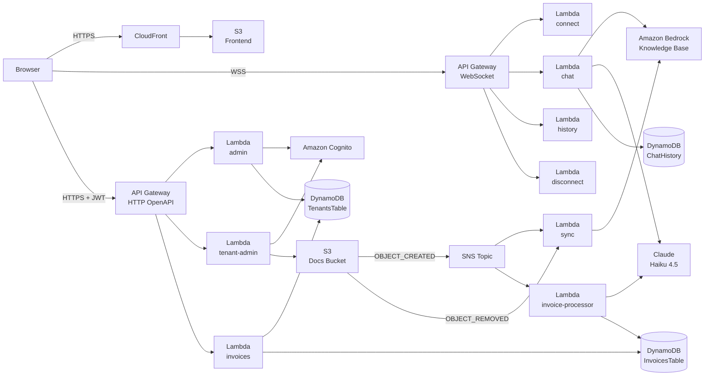
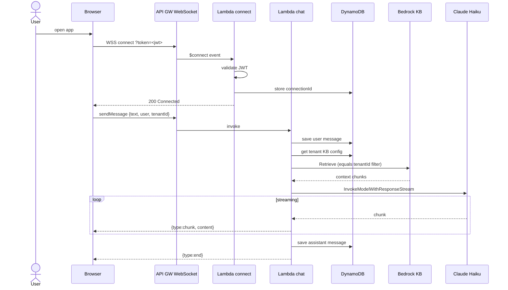
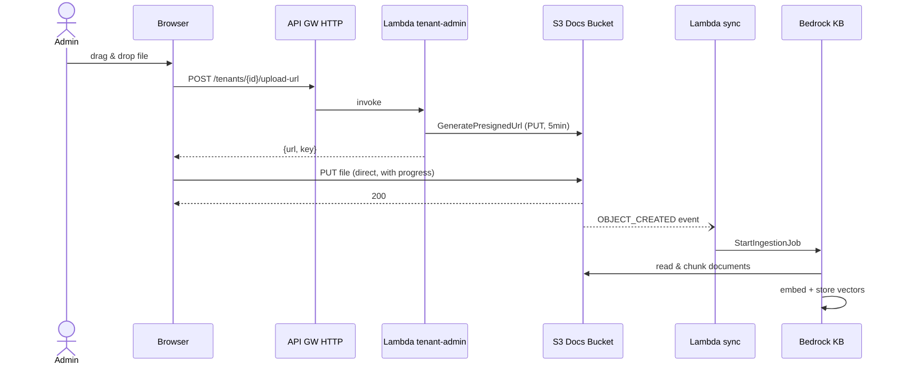
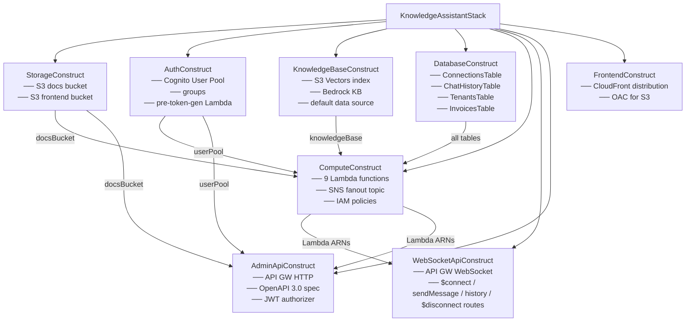
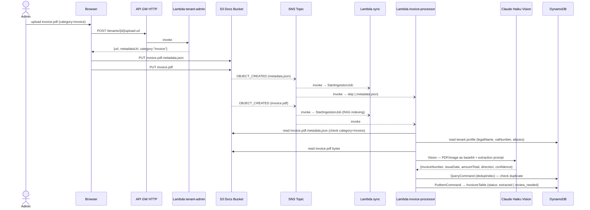

# System Architecture

## Overview

Knowledge Assistant is a serverless, multi-tenant RAG (Retrieval-Augmented Generation) platform built entirely on AWS managed services.

## AWS Services

| Service | Purpose |
|---|---|
| **CloudFront + S3** | Frontend hosting (React/Vite SPA) |
| **API Gateway WebSocket** | Real-time streaming chat |
| **API Gateway HTTP** | Admin REST API (tenants, users, uploads, invoices) |
| **Lambda (Node.js 20)** | All compute — stateless handlers |
| **Amazon Cognito** | User pool, authentication, group-based RBAC |
| **Amazon Bedrock** | Knowledge base management + Claude inference |
| **S3 Vectors** | Vector store for Bedrock embeddings |
| **DynamoDB** | Chat history, connections, tenant registry, invoices |
| **S3 (docs bucket)** | Tenant document storage (source for Bedrock + invoice processor) |

## Data Flow — Chat Message

## Data Flow — Document Ingestion

## Lambda Functions

| Lambda | Trigger | Responsibility |
|---|---|---|
| `connect` | WS `$connect` | JWT validation, store connectionId |
| `disconnect` | WS `$disconnect` | Remove connectionId |
| `chat` | WS `sendMessage` | RAG retrieval + LLM streaming |
| `history` | WS `history` / `clear_history` | Load/soft-delete chat history |
| `admin` | HTTP API | Tenant CRUD, full delete cleanup |
| `tenant-admin` | HTTP API | User CRUD, presigned upload URLs (category: general\|invoice) |
| `invoices` | HTTP API | Invoice CRUD, stats, presigned view URL, tenant profile |
| `invoice-processor` | S3 `OBJECT_CREATED` | Claude Vision extraction → InvoicesTable (category=invoice only) |
| `sync` | S3 `OBJECT_CREATED` | Start Bedrock ingestion job |
| `pre-token-gen` | Cognito trigger | Inject `custom:tenantId` into ID token |

Both `invoice-processor` and `sync` receive `OBJECT_CREATED` events via a shared **SNS topic** (S3 → SNS → Lambda subscriptions). This avoids the S3 constraint that prohibits two Lambda notifications for the same event type without non-overlapping prefix/suffix filters. `OBJECT_REMOVED` goes directly to `sync` only. Failures in either Lambda do not affect the other.

## Infrastructure as Code

The stack is defined in `infrastructure/` using AWS CDK v2 and `@cdklabs/generative-ai-cdk-constructs`. Each domain is encapsulated in its own CDK `Construct`:

| Construct file | Responsibility |
|---|---|
| `constructs/storage.construct.ts` | S3 docs bucket (with CORS) + frontend bucket |
| `constructs/auth.construct.ts` | Cognito User Pool, groups, pre-token-gen Lambda |
| `constructs/knowledge-base.construct.ts` | S3 Vectors index, Bedrock KB, default data source |
| `constructs/database.construct.ts` | DynamoDB — connections, chat history, tenants, invoices |
| `constructs/compute.construct.ts` | All Lambda functions + IAM policies + SNS topic + S3 event triggers |
| `constructs/websocket-api.construct.ts` | API Gateway WebSocket + routes + Lambda permissions |
| `constructs/admin-api.construct.ts` | HTTP API defined via **OpenAPI 3.0 spec** (see below) |
| `constructs/frontend.construct.ts` | CloudFront distribution with OAC |
| `knowledge-assistant-stack.ts` | Root stack — composes all constructs, emits CfnOutputs |

## Data Flow — Invoice Processing

## Admin API — OpenAPI Integration

The Admin HTTP API (`AdminApiConstruct`) is defined using an OpenAPI 3.0 spec passed directly to `CfnApi.body`. This means:

- Routes, integrations, CORS, and the JWT authorizer are all declared in the spec — no separate `CfnRoute` / `CfnIntegration` / `HttpJwtAuthorizer` resources
- The spec includes request/response schema definitions for all endpoints
- `x-amazon-apigateway-integration` extensions bind each operation to the correct Lambda (admin or tenant-admin) with `payloadFormatVersion: "2.0"`
- The JWT authorizer is declared as `securitySchemes.cognitoJwt` with `x-amazon-apigateway-authorizer`
- `$default` stage with `autoDeploy: true` is used (no manual deployment resource needed)

The full human-readable API reference is in [`docs/api.md`](api.md).

Key CDK resources:
- `bedrock.VectorKnowledgeBase` — shared KB with S3 Vectors backend
- `bedrock.S3DataSource` — one per tenant, with `inclusionPrefixes`
- `s3vectors.VectorBucket` / `VectorIndex` — Titan Text Embeddings v2 (1024 dims)
