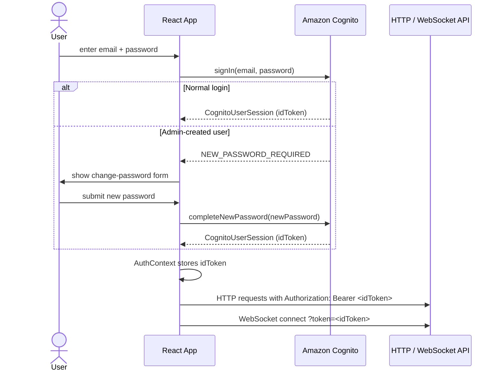

# Authentication & Authorization

## Cognito User Pool

All users are stored in a single Cognito User Pool. Self sign-up is disabled — users are created by admins only.

### Custom Attributes

| Attribute | Type | Purpose |
|---|---|---|
| `custom:tenantId` | String | Identifies which tenant the user belongs to |

### Groups

| Group | Purpose |
|---|---|
| `RootAdmin` | Full access — can create/delete tenants, manage any tenant's users |
| `TenantAdmin` | Can manage users within their own tenant only |
| _(no group)_ | Regular user — can only use the chat |

## Pre-Token Generation Trigger

`lambda/pre-token-gen/index.js` is invoked by Cognito before issuing an ID token. It injects `custom:tenantId` into the token claims so the frontend and Lambda authorizers can read it without an extra Cognito lookup.

```js
claimsToAddOrOverride['custom:tenantId'] = userAttributes['custom:tenantId']
```

## WebSocket Authentication

API Gateway WebSocket does not natively support JWT authorizers on `$connect`. Instead, the client passes the ID token as a query parameter:

```
wss://...execute-api.../prod?token=<idToken>
```

The `connect` Lambda (`lambda/connect/index.mjs`) manually validates the JWT:

1. Decodes the base64url payload (no signature verification in Lambda — relies on Cognito issuer URL match + expiry)
2. Checks `iss` matches `https://cognito-idp.{region}.amazonaws.com/{userPoolId}`
3. Checks `exp > now`
4. Checks `aud` or `client_id` matches the App Client ID
5. Stores `connectionId`, `userId`, `email`, `tenantId`, `groups` in DynamoDB

> **Note:** The connect Lambda does not verify the JWT signature cryptographically. It trusts the issuer URL and expiry check. For production hardening, consider adding signature verification via JWKS.

## HTTP API Authorization

The Admin HTTP API uses API Gateway's built-in JWT authorizer (`HttpJwtAuthorizer`) backed by Cognito. Authorization header: `Bearer <idToken>`.

Claims are forwarded to Lambda via `event.requestContext.authorizer.jwt.claims`.

### Authorization Matrix

| Endpoint | RootAdmin | TenantAdmin | Regular User |
|---|---|---|---|
| `GET /tenants` | ✅ | ❌ | ❌ |
| `POST /tenants` | ✅ | ❌ | ❌ |
| `PUT /tenants/{id}` | ✅ | ❌ | ❌ |
| `DELETE /tenants/{id}` | ✅ | ❌ | ❌ |
| `GET /tenants/{id}/users` | ✅ | ✅ (own tenant) | ❌ |
| `POST /tenants/{id}/users` | ✅ | ✅ (own tenant) | ❌ |
| `DELETE /tenants/{id}/users/{u}` | ✅ | ✅ (own tenant) | ❌ |
| `POST /tenants/{id}/upload-url` | ✅ | ✅ (own tenant) | ❌ |

### Group Parsing

Cognito groups can arrive in different formats depending on whether the claim came from the pre-token-gen trigger or the raw Cognito token. The `parseGroups` helper in both admin lambdas handles:

- Array: `["RootAdmin", "TenantAdmin"]`
- JSON string: `'["RootAdmin"]'`
- Bracket format: `'[RootAdmin]'` (unquoted, API GW serialization)
- Space/comma-separated: `'RootAdmin TenantAdmin'`

## Frontend Auth Flow


