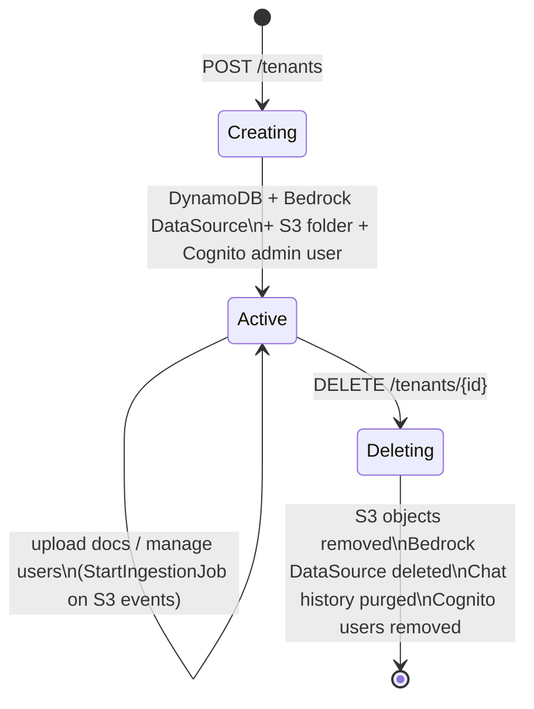

# Multi-Tenancy Design

## Tenant Model

Each tenant is an isolated workspace with:
- Its own S3 prefix (`{tenantId}/`) in the shared docs bucket
- A dedicated Bedrock S3DataSource with `inclusionPrefixes: ['{tenantId}/']`
- Its own Bedrock ingestion job history
- Cognito users tagged with `custom:tenantId`
- Chat history partitioned by `{tenantId}#{userId}` in DynamoDB

## DynamoDB Schemas

### TenantsTable

| Attribute | Type | Notes |
|---|---|---|
| `tenantId` | S (PK) | e.g. `acme` |
| `name` | S | Display name, e.g. `Acme Corp` |
| `knowledgeBaseId` | S | Bedrock KB ID (shared, same for all tenants) |
| `dataSourceId` | S | Bedrock data source ID (unique per tenant) |
| `docsPrefix` | S | S3 prefix, e.g. `acme/` |
| `createdAt` | S | ISO timestamp |

### ChatHistoryTable

| Attribute | Type | Notes |
|---|---|---|
| `tenantUser` | S (PK) | `{tenantId}#{userEmail}` |
| `timestamp` | S (SK) | ISO timestamp |
| `role` | S | `user` or `ai` |
| `text` | S | Message content |
| `isDeleted` | N | Soft delete flag (0 = active, 1 = deleted) |
| `ttl` | N | DynamoDB TTL (optional) |

### ConnectionsTable

| Attribute | Type | Notes |
|---|---|---|
| `connectionId` | S (PK) | API Gateway WebSocket connection ID |
| `userId` | S | Cognito `sub` |
| `email` | S | User email |
| `tenantId` | S | Tenant ID from JWT |
| `groups` | L | Cognito groups |
| `connectedAt` | S | ISO timestamp |

### InvoicesTable

Stores extracted invoice records produced by the document-processor Lambda.

| Attribute | Type | Notes |
|---|---|---|
| `tenantId` | S (PK) | Tenant owning the invoice |
| `invoiceId` | S (SK) | UUID generated at extraction time |
| `status` | S | `pending` → `extracted` | `review_needed` → `confirmed` | `rejected` → `paid` |
| `documentType` | S | `invoice`, `proforma`, or `credit_note` |
| `direction` | S | `incoming` (we are buyer) or `outgoing` (we are seller) |
| `invoiceNumber` | S | Extracted invoice number (optional) |
| `issueDate` | S | YYYY-MM-DD (optional) |
| `dueDate` | S | YYYY-MM-DD (optional) |
| `supplierName` | S | (optional) |
| `supplierVatNumber` | S | (optional) |
| `clientName` | S | (optional) |
| `clientVatNumber` | S | (optional) |
| `amountNet` | N | (optional) |
| `amountVat` | N | (optional) |
| `amountTotal` | N | (optional) |
| `confidence` | N | 0–1, from LLM normalization |
| `s3Key` | S | Original document S3 key |
| `s3Bucket` | S | S3 bucket name |
| `extractedAt` | S | ISO timestamp |
| `confirmedAt` | S | Set when status → `confirmed` (optional) |
| `paidAt` | S | Set when status → `paid` (optional) |
| `deduplicationKey` | S | `{supplierVatNumber}#{invoiceNumber}`, used for dedup (optional) |

**GSIs:**

| Index | PK | SK | Use |
|---|---|---|---|
| `dateIndex` | `tenantId` (S) | `issueDate` (S) | Date-range queries |
| `dedupIndex` | `tenantId` (S) | `deduplicationKey` (S) | Duplicate detection before insert |

`dedupIndex` projects `KEYS_ONLY`. When both `supplierVatNumber` and `invoiceNumber` are extracted, the document-processor queries this index to prevent saving the same invoice twice.

Also note: `TenantsTable` is extended with legal identity fields used by the extraction pipeline:

| Attribute | Type | Notes |
|---|---|---|
| `legalName` | S | Company legal name |
| `vatNumber` | S | VAT registration number |
| `bulstat` | S | Bulgarian registration number |
| `aliases` | L | List of alternative names used on documents |

## Tenant Lifecycle



### Creation (`POST /tenants`)

1. Validate `tenantId`, `name`, `adminEmail`, `temporaryPassword`
2. Write tenant record to **DynamoDB TenantsTable** (sets `docsPrefix`, `knowledgeBaseId`, `dataSourceId`)
3. Create Bedrock **S3DataSource** with `inclusionPrefixes: ['{tenantId}/']` and `dataDeletionPolicy: RETAIN`
4. Upload placeholder file to **S3** at `{tenantId}/.keep` to initialize the prefix
5. Call **StartIngestionJob** to sync the new data source
6. Create **Cognito user** (admin) with `custom:tenantId` attribute
7. Add user to **TenantAdmin** Cognito group

> **Order matters**: DynamoDB is written before S3 to avoid the race condition where the S3 event fires the sync Lambda before the tenant record exists.

### Deletion (`DELETE /tenants/{id}`)

Cleanup happens in this order to avoid orphaned resources:

1. **S3**: Delete all objects under `{tenantId}/` prefix (paginated with `ListObjectsV2`)
2. **Bedrock**: Delete the tenant's data source (`DeleteDataSourceCommand`) — non-fatal if fails
3. **DynamoDB**: Soft-scan ChatHistoryTable for `tenantUser` prefix `{tenantId}#`, delete matching items
4. **DynamoDB**: Delete tenant record from TenantsTable
5. **Cognito**: List and delete all users with `custom:tenantId = {tenantId}`

## RAG Isolation

Each tenant's documents are isolated at two levels:

### Level 1 — Bedrock Data Source

Each tenant has its own S3DataSource with `inclusionPrefixes`. Bedrock only indexes files under `{tenantId}/` for that data source.

### Level 2 — Retrieval Filter

At query time, the chat Lambda applies an `equals` filter on the `tenantId` metadata attribute (S3 Vectors supports `equals` but not `startsWith`):

```js
filter: { equals: { key: 'tenantId', value: tenantId } }
```

**Fallback**: If the filter throws or returns 0 results (e.g., legacy documents without `tenantId` metadata), the Lambda retries unfiltered and post-filters in code:

```js
results.filter(r =>
  r.location?.s3Location?.uri?.startsWith(sourcePrefix) ||
  r.metadata?.tenantId === tenantId
)
```

This double-layer approach ensures cross-tenant data leakage cannot occur even if one mechanism fails.
