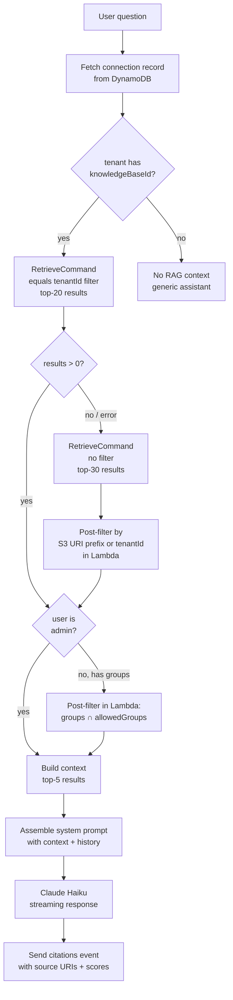

# RAG Pipeline

## Overview

The system uses Amazon Bedrock Knowledge Bases with an S3 Vectors backend. Documents are chunked and embedded by Bedrock; the embeddings are stored in an S3 Vectors index. At query time, relevant chunks are retrieved and injected as context into the Claude prompt.

## Embedding Model

- **Model**: Amazon Titan Text Embeddings v2
- **Dimensions**: 1024
- **Vector store**: Amazon S3 Vectors (`VectorBucket` + `VectorIndex`)

## Ingestion

### Trigger

Ingestion is triggered automatically by S3 events on the docs bucket:

- `OBJECT_CREATED` — new file uploaded → start ingestion job
- `OBJECT_REMOVED` — file deleted → start ingestion job (Bedrock detects missing file and removes its vectors)

The `sync` Lambda (`lambda/sync/index.mjs`) handles both events:

```js
// Determine which tenant's data source to sync
const tenantId = key.split('/')[0]
// Look up dataSourceId from TenantsTable
const { knowledgeBaseId, dataSourceId } = await dynamo.get(tenantId)
// Kick off ingestion
await bedrock.send(new StartIngestionJobCommand({ knowledgeBaseId, dataSourceId }))
```

### Data Sources

Each tenant has a dedicated `S3DataSource` with:

```ts
inclusionPrefixes: [`${tenantId}/`]
dataDeletionPolicy: 'RETAIN'  // Prevents vector store errors on deletion
```

`RETAIN` is set to avoid errors when deleting a data source before the S3 Vectors permissions are fully propagated. Vectors are explicitly cleaned up by granting the KB execution role `s3vectors:DeleteVectors` permission.

## Document Metadata & Group Tagging

When uploading a document `tenantId/file.pdf`, a companion metadata file `tenantId/file.pdf.metadata.json` must be uploaded with:

```json
{
  "metadataAttributes": {
    "tenantId": "acme",
    "groups": ["financial", "IT"]
  }
}
```

Bedrock indexes these attributes alongside the document vectors. `tenantId` is used for the primary KB-level retrieval filter. `groups` is post-filtered in the chat Lambda (S3 Vectors does not support `listContains`).

Documents without a metadata file (or with no `groups` attribute) are treated as accessible to all users (backward compatible with existing untagged documents). Documents without `tenantId` in metadata fall back to URI-based isolation.

## Retrieval Pipeline



## Retrieval

The chat Lambda (`lambda/chat/index.mjs`) retrieves context before generating a response.

### Connection Record Lookup

At the start of each request, the Lambda fetches the authoritative connection record from DynamoDB (`CONNECTIONS_TABLE`) using `connectionId`. This provides the verified `tenantId`, `email`, and `groups` — the client-supplied body is not trusted for identity.

```js
const connItem = await dynamo.send(new GetItemCommand({
  TableName: process.env.CONNECTIONS_TABLE,
  Key: { connectionId: { S: connectionId } }
}));
const tenantId = connItem.Item?.tenantId?.S;
const userGroups = (connItem.Item?.groups?.L || []).map(g => g.S);
```

### Step 1: Primary KB Filter (equals tenantId)

Applies an `equals` filter on the `tenantId` metadata attribute. This is the efficient path for documents that have `tenantId` in their `.metadata.json`:

```js
filter: { equals: { key: 'tenantId', value: tenantId } }
```

Retrieves top-20 results. S3 Vectors supports `equals`, `notEquals`, `in`, `notIn` — `startsWith` and `listContains` are not supported and must be handled in Lambda.

### Step 2: Fallback (Unfiltered + URI Post-Filter)

If the KB filter returns 0 results (filter error, or legacy documents without `tenantId` metadata), the Lambda retries without a filter, fetching top-30, then post-filters in code:

```js
results.filter(r =>
  r.location?.s3Location?.uri?.startsWith(sourcePrefix) ||
  r.metadata?.tenantId === tenantId
)
```

This handles backward compatibility with documents uploaded before `tenantId` metadata was introduced.

### Step 3: Group Access Control (Lambda Post-Filter)

For non-admin users with assigned business groups, the Lambda post-filters the tenant-isolated results:

```js
const allowedGroups = new Set([...businessGroups, 'general']);
results = results.filter(r => {
  const raw = r.metadata?.groups;
  if (raw == null) return true; // no groups metadata → accessible to all
  // parse groups (S3 Vectors returns array metadata as JSON string)
  const list = parseGroups(raw);
  return list.some(g => allowedGroups.has(g));
});
```

Documents tagged with `general` are accessible to all users regardless of group membership. Documents with no `groups` metadata are also accessible to all (legacy backward compatibility).

The final result is sliced to top-5 for context injection.

### Step 4: Prompt Assembly

Retrieved chunks are joined and injected into the system message:

```
You are a helpful knowledge base assistant. Use the following context to answer questions.

Context:
<chunk 1>

---

<chunk 2>

If the context doesn't contain relevant information, say so.
Write in the same language as the user's question.
```

If no knowledge base is configured for the tenant, the generic "helpful assistant" system prompt is used.

## Citations

After the assistant response is complete, the chat Lambda sends a `citations` WebSocket event with up to 5 source references used in the response:

```json
{
  "type": "citations",
  "citations": [
    {
      "source": "s3://bucket/tenant/doc.pdf",
      "score": 0.92,
      "excerpt": "First 200 characters of the retrieved chunk..."
    }
  ]
}
```

The frontend hook (`useWebSocket`) attaches citations to the corresponding assistant message. The chat UI renders them in a collapsible "Sources" panel below the message.

## Supported Document Formats

Bedrock Knowledge Bases natively support: PDF, DOCX, TXT, MD, HTML, CSV, XLS/XLSX.

## Chat History

The last 20 non-deleted messages (`isDeleted = 0`) for the `tenantUser` partition key are fetched from DynamoDB and included in the messages array sent to Claude. This provides conversational context without re-retrieving RAG context for each turn.

## Model Configuration

| Setting | Value |
|---|---|
| Provider | `bedrock` (default) or `openai` (via `MODEL_PROVIDER` env var) |
| Bedrock model | `eu.anthropic.claude-haiku-4-5-20251001-v1:0` (EU inference profile) |
| OpenAI model | `gpt-4.1-mini` (configurable via `OPENAI_MODEL` env var) |
| Max tokens | 4096 |
| Streaming | Yes (WebSocket chunks) for Bedrock; single response for OpenAI |
