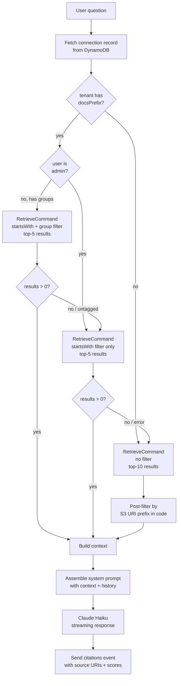

# RAG Pipeline

## Overview

The system uses Amazon Bedrock Knowledge Bases with an S3 Vectors backend. Documents are chunked and embedded by Bedrock; the embeddings are stored in an S3 Vectors index. At query time, relevant chunks are retrieved and injected as context into the Claude prompt.

## Embedding Model

- **Model**: Amazon Titan Text Embeddings v2
- **Dimensions**: 1024
- **Vector store**: Amazon S3 Vectors (`VectorBucket` + `VectorIndex`)

## Ingestion

### Trigger

Ingestion is triggered automatically by S3 events on the docs bucket:

- `OBJECT_CREATED` — new file uploaded → start ingestion job
- `OBJECT_REMOVED` — file deleted → start ingestion job (Bedrock detects missing file and removes its vectors)

The `sync` Lambda (`lambda/sync/index.mjs`) handles both events:

```js
// Determine which tenant's data source to sync
const tenantId = key.split('/')[0]
// Look up dataSourceId from TenantsTable
const { knowledgeBaseId, dataSourceId } = await dynamo.get(tenantId)
// Kick off ingestion
await bedrock.send(new StartIngestionJobCommand({ knowledgeBaseId, dataSourceId }))
```

### Data Sources

Each tenant has a dedicated `S3DataSource` with:

```ts
inclusionPrefixes: [`${tenantId}/`]
dataDeletionPolicy: 'RETAIN'  // Prevents vector store errors on deletion
```

`RETAIN` is set to avoid errors when deleting a data source before the S3 Vectors permissions are fully propagated. Vectors are explicitly cleaned up by granting the KB execution role `s3vectors:DeleteVectors` permission.

## Document Metadata & Group Tagging

When uploading a document `tenantId/file.pdf`, a companion metadata file `tenantId/file.pdf.metadata.json` must be uploaded with:

```json
{
  "metadataAttributes": {
    "groups": ["financial", "IT"]
  }
}
```

Bedrock indexes these attributes alongside the document vectors. The `listContains` filter operator checks if the `groups` array contains a specific group name.

Documents without a metadata file (or with no `groups` attribute) are treated as accessible to all users (backward compatible with existing untagged documents).

## Retrieval Pipeline



## Retrieval

The chat Lambda (`lambda/chat/index.mjs`) retrieves context before generating a response.

### Connection Record Lookup

At the start of each request, the Lambda fetches the authoritative connection record from DynamoDB (`CONNECTIONS_TABLE`) using `connectionId`. This provides the verified `tenantId`, `email`, and `groups` — the client-supplied body is not trusted for identity.

```js
const connItem = await dynamo.send(new GetItemCommand({
  TableName: process.env.CONNECTIONS_TABLE,
  Key: { connectionId: { S: connectionId } }
}));
const tenantId = connItem.Item?.tenantId?.S;
const userGroups = (connItem.Item?.groups?.L || []).map(g => g.S);
```

### Step 1: Filter-Based Retrieval

Applies a `startsWith` filter for tenant isolation. For non-admin users with business groups, also applies a `listContains` group filter:

```js
// Admin user — tenant isolation only
filter: { startsWith: { key: 'x-amz-bedrock-kb-source-uri', value: sourcePrefix } }

// Business user with groups — tenant isolation + group access
filter: {
  andAll: [
    { startsWith: { key: 'x-amz-bedrock-kb-source-uri', value: sourcePrefix } },
    { orAll: businessGroups.map(g => ({ listContains: { key: 'groups', value: g } })) }
  ]
}
```

Retrieves top-5 results.

### Step 1a: Group-Filter Fallback

If the group-filtered query returns 0 results (e.g., all documents are untagged legacy docs), the Lambda retries with tenant isolation only — ensuring backward compatibility with pre-existing untagged documents.

### Step 2: Fallback (Unfiltered + Post-Filter)

If the filter throws (S3 Vectors backend may not support all filter types) or returns 0 results, the Lambda retries without the filter, fetching top-10, then applies the prefix check in code:

```js
all.filter(r => r.location?.s3Location?.uri?.startsWith(sourcePrefix))
```

This guarantees cross-tenant isolation even when the server-side filter is unavailable.

### Step 3: Prompt Assembly

Retrieved chunks are joined and injected into the system message:

```
You are a helpful knowledge base assistant. Use the following context to answer questions.

Context:
<chunk 1>

---

<chunk 2>

If the context doesn't contain relevant information, say so.
Write in the same language as the user's question.
```

If no knowledge base is configured for the tenant, the generic "helpful assistant" system prompt is used.

## Citations

After the assistant response is complete, the chat Lambda sends a `citations` WebSocket event with up to 5 source references used in the response:

```json
{
  "type": "citations",
  "citations": [
    {
      "source": "s3://bucket/tenant/doc.pdf",
      "score": 0.92,
      "excerpt": "First 200 characters of the retrieved chunk..."
    }
  ]
}
```

The frontend hook (`useWebSocket`) attaches citations to the corresponding assistant message. The chat UI renders them in a collapsible "Sources" panel below the message.

## Supported Document Formats

Bedrock Knowledge Bases natively support: PDF, DOCX, TXT, MD, HTML, CSV, XLS/XLSX.

## Chat History

The last 20 non-deleted messages (`isDeleted = 0`) for the `tenantUser` partition key are fetched from DynamoDB and included in the messages array sent to Claude. This provides conversational context without re-retrieving RAG context for each turn.

## Model Configuration

| Setting | Value |
|---|---|
| Provider | `bedrock` (default) or `openai` (via `MODEL_PROVIDER` env var) |
| Bedrock model | `eu.anthropic.claude-haiku-4-5-20251001-v1:0` (EU inference profile) |
| OpenAI model | `gpt-4.1-mini` (configurable via `OPENAI_MODEL` env var) |
| Max tokens | 4096 |
| Streaming | Yes (WebSocket chunks) for Bedrock; single response for OpenAI |
